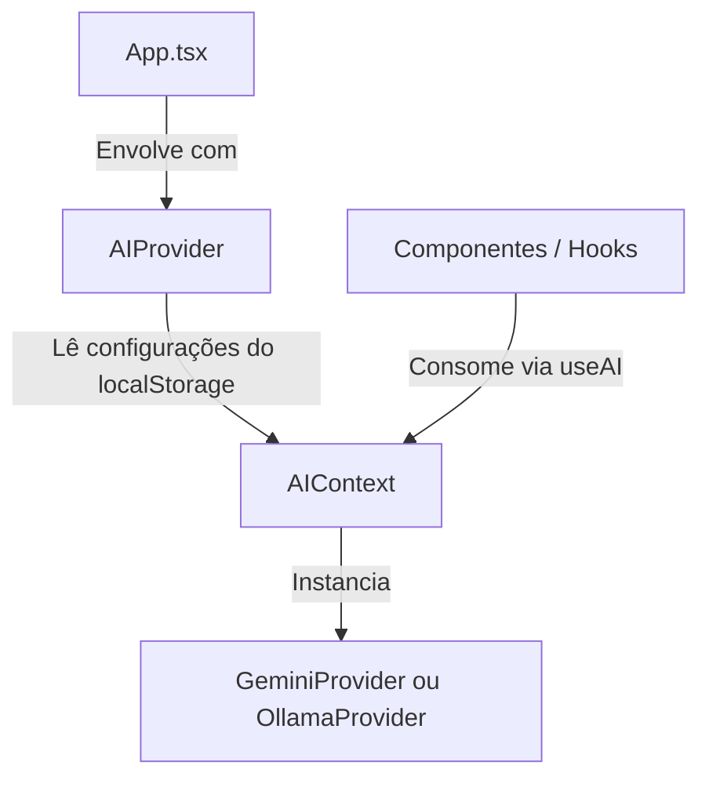

# Arquitetura de Integração com Inteligência Artificial 🧠🔌

Esta documentação descreve o design da camada de abstração de Inteligência Artificial implementada no **Memorize**.

---

## 1. Visão Geral

Historicamente, o Memorize dependia de chamadas diretas à API REST do Google Gemini em diversas páginas e componentes. Para suportar processadores locais gratuitos (como o **Ollama**) em conjunto com provedores de nuvem sem duplicar código ou expor lógica de rede nos componentes de UI, adotamos uma arquitetura desacoplada baseada no padrão **Injeção de Dependência (Dependency Injection - DI)**.

### Benefícios
1.  **Desacoplamento**: Os componentes visuais e utilitários não conhecem detalhes de endpoints, chaves de API ou esquemas específicos de rede.
2.  **Troca Dinâmica**: O usuário pode alternar o provedor de IA nas configurações (ex: mudar de Gemini para Ollama local) e todo o sistema se adapta instantaneamente sem recarregar a página.
3.  **Testabilidade**: É simples mockar o serviço de IA para testes unitários.
4.  **Extensibilidade**: Adicionar novos provedores (como OpenAI, Groq ou Claude) requer apenas a criação de um novo arquivo de provedor que respeite o contrato definido.

---

## 2. Estrutura de Contratos (`src/services/ai/types.ts`)

A base do desacoplamento é a interface `AIService` e seus tipos de dados de entrada/saída:

```typescript
export interface ChatMessageParam {
  role: 'system' | 'user' | 'assistant';
  content: string;
}

export interface AIContentRequest {
  systemPrompt?: string;
  messages: ChatMessageParam[];
  responseMimeType?: 'application/json' | 'text/plain';
  responseSchema?: any; // Utilizado pelo Gemini para forçar respostas estruturadas
  images?: {
    mimeType: string;
    data: string; // Base64 limpo, sem o prefixo "data:image/*;base64,"
  }[];
}

export interface AIService {
  generateContent(request: AIContentRequest): Promise<string>;
}
```

---

## 3. Fluxo de Injeção de Dependência (DI) em React

Utilizamos o **React Context** como o mecanismo nativo de Injeção de Dependência. O `AIProvider` gerencia os estados de configuração e expõe a instância ativa do `AIService` aos filhos.



### O Hook `useAI()`
Os componentes que precisam de IA apenas chamam o hook `useAI()` para acessar a instância configurada do serviço:

```typescript
const { aiService, aiProvider, testConnection } = useAI();

// Exemplo de chamada agnóstica:
const response = await aiService.generateContent({
  messages: [{ role: 'user', content: 'Translate to English: Olá' }]
});
```

---

## 4. Provedores de IA Suportados

### A. Gemini (Nuvem) — `GeminiProvider`
*   **Endpoint**: `https://generativelanguage.googleapis.com/v1beta/models/gemini-2.5-flash:generateContent?key=...`
*   **Tratamento de Imagem**: Converte os arquivos Base64 fornecidos para o formato de parte do Gemini (`inlineData`).
*   **Schema Estruturado**: Mapeia diretamente o `responseSchema` e `responseMimeType` para a seção `generationConfig` do payload JSON oficial do Gemini.

### B. Ollama (Local) — `OllamaProvider`
*   **Endpoints**:
    *   `/api/chat`: Utilizado para chamadas gerais e de conversação (mantém a compatibilidade com mensagens estruturadas de `system`, `user` e `assistant`).
    *   `/api/generate`: Utilizado para prompts simples ou prompts multimodais com imagens (envia o texto e as imagens brutas em Base64 no array de `images`).
*   **CORS (Cross-Origin Resource Sharing)**:
    Como o navegador restringe chamadas cross-origin de segurança a servidores locais, o Ollama local precisa ser iniciado com suporte a origens habilitadas (`OLLAMA_ORIGINS=*`), caso contrário as requisições serão bloqueadas pelo navegador.

---

## 5. Como Adicionar um Novo Provedor

Para adicionar um novo provedor (ex: `OpenAIProvider`):
1.  Crie o arquivo em `src/services/ai/providers/openai.ts`.
2.  Implemente a classe herdando a interface:
    ```typescript
    import { AIService, AIContentRequest } from '../types';
    export class OpenAIProvider implements AIService {
      async generateContent(request: AIContentRequest): Promise<string> {
        // ... chamada fetch à API da OpenAI ...
      }
    }
    ```
3.  Adicione as configurações no `AIContext.tsx` e instancie o novo provedor quando a opção correspondente estiver ativa.

---

## 6. Estratégia de Testes

*   **Vitest**: Utilizamos a suíte Vitest do projeto para testes de unidade.
*   **Mocking**: Mocado o objeto global `fetch` para interceptar as chamadas feitas por cada provedor, verificando se o payload gerado está correto para as especificações do Gemini e do Ollama, e testando também o tratamento de falhas de rede ou quotas estouradas.
