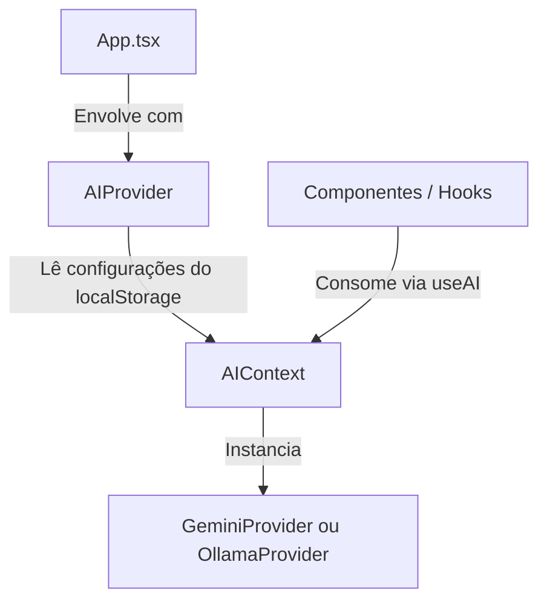

# Arquitetura de Integração com Inteligência Artificial 🧠🔌

Esta documentação descreve o design da camada de abstração de Inteligência Artificial implementada no **Memorize**.

---

## 1. Visão Geral

Historicamente, o Memorize dependia de chamadas diretas à API REST do Google Gemini em diversas páginas e componentes. Para suportar processadores locais gratuitos (como o **Ollama**) em conjunto com provedores de nuvem sem duplicar código ou expor lógica de rede nos componentes de UI, adotamos uma arquitetura desacoplada baseada no padrão **Injeção de Dependência (Dependency Injection - DI)**.

### Benefícios
1.  **Desacoplamento**: Os componentes visuais e utilitários não conhecem detalhes de endpoints, chaves de API ou esquemas específicos de rede.
2.  **Troca Dinâmica**: O usuário pode alternar o provedor de IA nas configurações (ex: mudar de Gemini para Ollama local) e todo o sistema se adapta instantaneamente sem recarregar a página.
3.  **Testabilidade**: É simples mockar o serviço de IA para testes unitários.
4.  **Extensibilidade**: Adicionar novos provedores (como OpenAI, Groq ou Claude) requer apenas a criação de um novo arquivo de provedor que respeite o contrato definido.

---

## 2. Estrutura de Contratos (`src/services/ai/types.ts`)

A base do desacoplamento é a interface `AIService` e seus tipos de dados de entrada/saída:

```typescript
export interface ChatMessageParam {
  role: 'system' | 'user' | 'assistant';
  content: string;
}

export interface AIContentRequest {
  systemPrompt?: string;
  messages: ChatMessageParam[];
  responseMimeType?: 'application/json' | 'text/plain';
  responseSchema?: any; // Utilizado pelo Gemini para forçar respostas estruturadas
  images?: {
    mimeType: string;
    data: string; // Base64 limpo, sem o prefixo "data:image/*;base64,"
  }[];
}

export interface AIService {
  generateContent(request: AIContentRequest): Promise<string>;
}
```

---

## 3. Fluxo de Injeção de Dependência (DI) em React

Utilizamos o **React Context** como o mecanismo nativo de Injeção de Dependência. O `AIProvider` gerencia os estados de configuração e expõe a instância ativa do `AIService` aos filhos.



### O Hook `useAI()`
Os componentes que precisam de IA apenas chamam o hook `useAI()` para acessar a instância configurada do serviço:

```typescript
const { aiService, aiProvider, testConnection } = useAI();

// Exemplo de chamada agnóstica:
const response = await aiService.generateContent({
  messages: [{ role: 'user', content: 'Translate to English: Olá' }]
});
```

---

## 4. Provedores de IA Suportados

### A. Gemini (Nuvem) — `GeminiProvider`
*   **Endpoint**: `https://generativelanguage.googleapis.com/v1beta/models/gemini-2.5-flash:generateContent?key=...`
*   **Tratamento de Imagem**: Converte os arquivos Base64 fornecidos para o formato de parte do Gemini (`inlineData`).
*   **Schema Estruturado**: Mapeia diretamente o `responseSchema` e `responseMimeType` para a seção `generationConfig` do payload JSON oficial do Gemini.

### B. Ollama (Local) — `OllamaProvider`
*   **Endpoints**:
    *   `/api/chat`: Utilizado para chamadas gerais e de conversação (mantém a compatibilidade com mensagens estruturadas de `system`, `user` e `assistant`).
    *   `/api/generate`: Utilizado para prompts simples ou prompts multimodais com imagens (envia o texto e as imagens brutas em Base64 no array de `images`).
*   **CORS (Cross-Origin Resource Sharing)**:
    Como o navegador restringe chamadas cross-origin de segurança a servidores locais, o Ollama local precisa ser iniciado com suporte a origens habilitadas (`OLLAMA_ORIGINS=*`), caso contrário as requisições serão bloqueadas pelo navegador.

---

## 5. Como Adicionar um Novo Provedor

Para adicionar um novo provedor (ex: `OpenAIProvider`):
1.  Crie o arquivo em `src/services/ai/providers/openai.ts`.
2.  Implemente a classe herdando a interface:
    ```typescript
    import { AIService, AIContentRequest } from '../types';
    export class OpenAIProvider implements AIService {
      async generateContent(request: AIContentRequest): Promise<string> {
        // ... chamada fetch à API da OpenAI ...
      }
    }
    ```
3.  Adicione as configurações no `AIContext.tsx` e instancie o novo provedor quando a opção correspondente estiver ativa.

---

## 6. Estratégia de Testes

*   **Vitest**: Utilizamos a suíte Vitest do projeto para testes de unidade.
*   **Mocking**: Mocado o objeto global `fetch` para interceptar as chamadas feitas por cada provedor, verificando se o payload gerado está correto para as especificações do Gemini e do Ollama, e testando também o tratamento de falhas de rede ou quotas estouradas.

---

## 7. Processamento e Segmentação de Texto para Leitura (`src/utils/readingProcessor.ts`)

O processamento de leitura utiliza IA para extrair sentenças, traduzi-las e identificar palavras-chave. Para contornar limitações de capacidade, limites de tokens de saída de LLMs locais (Ollama/Llama 3.2) e comportamento preguiçoso de agrupamento de frases, implementamos as seguintes melhorias na camada de processamento:

### A. Pré-Segmentação de Sentenças por Expressão Regular
Antes de enviar o texto para o modelo de IA, realizamos a segmentação do texto original baseada em sentenças no frontend. Isso ajuda a IA (especialmente modelos locais) a estruturar a resposta sem misturar ou agrupar frases vizinhas.
*   **Expressão Regular**:
    ```javascript
    /(?<!\b(?:Dr|Mr|Ms|Mrs|Jr|Sr|vs|Prof|St|i\.e|e\.g))([.!?])(["'”’]?)\s+(?=["'“‘]?[A-Z0-9\u00C0-\u00FF])/gi
    ```
*   **Recursos**:
    *   **Negative Lookbehind (`(?<!...)`)**: Impede a quebra em abreviações comuns da língua inglesa (como `Dr.`, `Mr.`, `e.g.`, `vs.`).
    *   **Captura de Fechamento de Aspas (`(["'”’]?)`)**: Garante que aspas finais de citações ou falas de personagens continuem associadas à sentença correspondente.
    *   **Lookahead para Abertura de Aspas e Letra Maiúscula (`(?=["'“‘]?[A-Z0-9...])`)**: Assegura que a divisão só aconteça se a próxima sentença começar com letra maiúscula, número ou uma aspa de abertura seguida de letra maiúscula.

### B. Segmentação Estrita no Prompt
Forçamos a IA a não aglutinar sentenças por meio de instruções explícitas:
*   **Regra**: *"Cada frase/sentença individual do texto fornecido deve ser mapeada para um objeto separado no array 'lines'. Nunca junte ou mescle múltiplas frases/sentenças em uma única entrada no campo 'original'."*

### C. Parser Defensivo para JSON de Modelos Variados (`parseAIResponse`)
Modelos locais de menor parâmetro podem retornar formatos de JSON aninhados ou encapsular a resposta em blocos explicativos de texto ou markdown. O parser é tolerante e lida com:
1.  **Remoção de Markdown**: Remove wrappers de código markdown (como ` ```json ` e ` ``` `).
2.  **Extração de Bloco**: Localiza a estrutura JSON usando os índices dos caracteres `{` e `}` caso a resposta contenha diálogos ou notas adicionais da IA ao redor do JSON.
3.  **Busca Tolerante de Chaves**: Caso o array de frases não esteja na raiz (`lines`), o parser busca recursivamente por chaves como `response.lines`, `data.lines`, qualquer chave que armazene um array, ou assume que a raiz do JSON já é o próprio array de sentenças.
4.  **Mapeamento de Propriedades fallback**: Mapeia chaves variantes das propriedades do objeto (ex: `text` / `originalText` mapeiam para `original`; `translation` / `translatedText` mapeiam para `translated`).
5.  **Robustez de Tipos**: Filtra elementos não-texto em arrays (como `highlights` contendo inteiros ou nulos) e lança erros padronizados (como `"não contém o campo "lines""` ou `"formato inesperado"`) em total conformidade com a suíte de testes.

