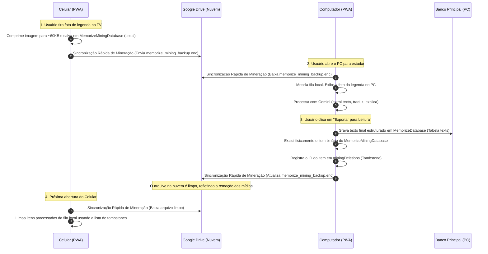

# Especificação Técnica: Arquitetura de Duas Bases e Sincronização Isolada para Mineração

Este documento detalha o design de software, modelagem de dados e especificação da arquitetura de sincronização para a **Fila de Mineração de Sentenças (Sentence Mining Inbox)** do aplicativo Memorize.

---

## 1. Visão Geral do Problema e Motivação

A fila de mineração de sentenças permite capturar imagens (legendas de filmes/séries) e gravações de voz diretamente do celular de forma instantânea (offline) enquanto o usuário assiste a conteúdos na TV ou PC. 

No entanto, estes arquivos binários (imagens comprimidas e áudios gravados) ocupam um espaço significativamente maior em bytes do que os cartões normais de texto do SRS. Na arquitetura anterior de banco de dados unificado:
1. Toda sincronização precisava serializar, criptografar e transmitir todas as mídias da mineração, degradando o tempo de resposta do sync na nuvem (Google Drive).
2. O sync do celular consumia dados móveis excessivos.
3. Não havia propagação de exclusão física dos itens (as mídias aprovadas eram mantidas localmente com referências limpas), gerando bloat lento no IndexedDB e no arquivo `.enc` do Drive.

### A Solução Proposta
Propomos um desacoplamento de banco de dados e arquivos de sincronização:
* **Banco Primário (`MemorizeDatabase`)**: Contém baralhos, cartões, textos do Reading, sessões de estudo e configurações. É sincronizado no arquivo `memorize_backup.enc`.
* **Banco Secundário (`MemorizeMiningDatabase`)**: Contém única e estritamente a fila temporária de captura (`miningItems`) e seu log de exclusão (`miningDeletions`). É sincronizado de forma isolada no arquivo `memorize_mining_backup.enc`.

---

## 2. A Arquitetura das Duas Bases de Dados

O aplicativo gerencia dois bancos de dados IndexedDB independentes via **Dexie.js**:

```mermaid
graph TD
    subgraph Browser IndexedDB
        subgraph MemorizeDatabase (Base Principal)
            DB_Decks[(Decks)]
            DB_Cards[(Cards)]
            DB_Texts[(Texts)]
            DB_Notes[(Notes)]
        end
        subgraph MemorizeMiningDatabase (Base Temporária)
            DB_MiningItems[(Mining Items)]
            DB_MiningDeletions[(Mining Deletions)]
        end
    end
    
    subgraph Google Drive Backup Files
        Backup_Main[memorize_backup.enc]
        Backup_Mining[memorize_mining_backup.enc]
    end

    MemorizeDatabase -->|Sync Geral| Backup_Main
    MemorizeMiningDatabase -->|Sync Rápido Fila| Backup_Mining
```

### 2.1 Schema do Banco Primário (`MemorizeDatabase`)
Mantém todos os dados estáveis de estudo. Os registros de textos importados da mineração são salvos na tabela `texts` (`TextResource`), herdando o tema e a categoria, porém **sem o payload pesado de imagens ou áudio bruto**.

### 2.2 Schema do Banco Secundário (`MemorizeMiningDatabase`)
Armazena a fila temporária de captura:
1. **`miningItems`**: Tabela com os cards de mineração pendentes. Contém a imagem (base64 compressed JPEG), o áudio (base64 ogg), texto, tradução, explicação de IA, categoria e tema.
2. **`miningDeletions`**: Tabela de rastreamento de exclusões (tombstones). Registra `{ id: string, deletedAt: number }` toda vez que um item é excluído fisicamente (descartado ou aprovado/exportado para o módulo Reading).

---

## 3. Fluxo de Trabalho e Ciclo de Vida da Mineração

O ciclo de vida completo de uma frase capturada funciona da seguinte maneira:



---

## 4. O Mecanismo de Sincronização com Tombstones (Deleções)

Como os dados na fila de mineração são excluídos fisicamente do banco após a aprovação para economizar espaço, precisamos de um mecanismo para que outros dispositivos saibam que um item foi *deletado* (e não que ele é um item novo criado remotamente que deve ser baixado).

### 4.1 Estratégia de Mesclagem Bidirecional (Merge com Tombstones)
Quando o módulo de sincronização do banco de mineração é acionado, ele executa as seguintes etapas:

1. **Download do Backup**: Baixa e descriptografa o arquivo `memorize_mining_backup.enc`.
2. **Coleta de Deleções**: 
   * Obtém a lista de IDs deletados locais (`miningDeletions`) e remotos (vindos do payload do Drive).
3. **União de Deleções**:
   * Cria uma lista unificada de deleções (IDs únicos).
   * Filtra essa lista para manter apenas deleções que ocorreram nos últimos 14 dias (evitando que a tabela cresça eternamente).
4. **Aplicação das Deleções**:
   * Exclui qualquer item local na tabela `miningItems` que esteja presente na lista unificada de deleções.
   * Remove da lista de itens remotos (baixados do Drive) qualquer item contido na lista unificada de deleções.
5. **Mesclagem de Itens Restantes (Two-way Merge)**:
   * Para cada item restante no payload do Drive:
     * Se não existir localmente, adiciona à tabela `miningItems` (captura nova feita em outro dispositivo).
     * Se existir localmente, compara o campo `updatedAt` e mantém a versão mais recente.
6. **Gravação e Envio**:
   * Salva o novo estado unificado das tabelas locais `miningItems` e `miningDeletions`.
   * Serializa, criptografa e envia a base de mineração atualizada de volta para o Google Drive (`memorize_mining_backup.enc`).

---

## 5. Experiência do Usuário (UI/UX) e Otimizações de Fluxo

Para tornar este processo invisível e rápido, implementaremos três otimizações chave:

### 5.1 Cache Temporário de Senha de Criptografia (`sessionStorage`)
* **Problema**: O app solicita a senha de criptografia em cada sync por questões de segurança (não salvando nada em `localStorage`). Digitar a senha no celular em cada foto tirada arruinaria a experiência.
* **Solução**: Assim que o usuário digita a senha de sincronização uma vez no app, a senha é guardada em memória de sessão (`sessionStorage.setItem('memorize_sync_password', password)`). 
* **Segurança**: O `sessionStorage` é isolado por aba e é apagado imediatamente assim que a aba ou o navegador são fechados, garantindo segurança muito superior ao `localStorage`, ao mesmo tempo em que elimina a necessidade de digitar senhas repetidamente durante uma sessão de estudo.

### 5.2 Botão de Sincronização Direta na Fila
* A tela de Fila de Mineração contará com um botão dedicado e proeminente de **Sincronização Rápida** no topo.
* O usuário não precisa navegar até a página de Configurações para sincronizar suas capturas de tela. Ao clicar, o sistema fará o upload/download apenas da fila, completando o sync em menos de 2 segundos.

### 5.3 Migração Transparente de Dados
* Na primeira inicialização do app após a atualização, uma rotina lê a tabela antiga `miningItems` do banco principal.
* Se houver itens pendentes, eles são movidos em lote para o novo banco `MemorizeMiningDatabase`.
* O banco de dados principal tem a tabela antiga limpa, liberando o armazenamento interno.
