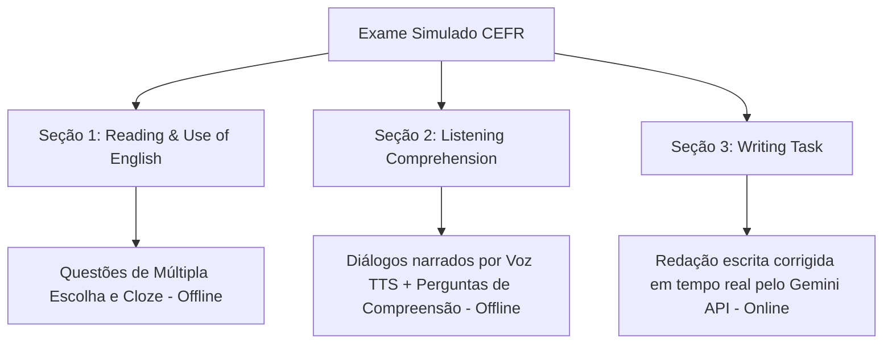

# Especificação Técnica Final: Planejador de Jornada de Estudos CEFR e Simulador de Exames

Este documento serve como referência oficial para a implementação do planejador de estudos baseado no CEFR, das regras de recálculo de metas e do sistema de exames simulados.

---

## 1. Visão Geral da Funcionalidade
O módulo de **Jornada de Estudos CEFR** introduz uma abordagem de aprendizado orientada a objetivos, simulando a preparação para exames internacionais (como Cambridge, IELTS e TOEFL). O aluno define um nível de proficiência alvo e um prazo, e o sistema estabelece um cronograma diário, exigindo a aprovação em exames oficiais simulados para avançar entre os níveis de proficiência.

---

## 2. O Planejador de Metas (Cronograma)

### Fórmulas Matemáticas de Esforço Diário
Com base no nível atual do usuário ($L_{atual}$), no nível alvo ($L_{alvo}$) e no prazo em dias ($T_{dias}$):

1. **Lacuna de Vocabulário ($\Delta_{cards}$)**:
   $$\Delta_{cards} = \max(0, \text{Meta\_Vocab}(L_{alvo}) - \text{Cartas\_Atuais})$$
2. **Novos Cartões Necessários por Dia ($C_{diarios}$)**:
   $$C_{diarios} = \lceil \frac{\Delta_{cards}}{T_{dias}} \rceil$$
3. **Lacuna de Horas Estimada ($\Delta_{horas}$)**:
   $$\text{Horas\_Meta}(L_{alvo}) - \left( \text{Horas\_Meta}(L_{atual}) \times \frac{\text{Cartas\_Atuais}}{\text{Meta\_Vocab}(L_{atual})} \right)$$
4. **Esforço Diário Estimado em Minutos ($M_{diarios}$)**:
   $$M_{diarios} = \lceil \frac{\Delta_{horas} \times 60}{T_{dias}} \rceil$$

### Tabelas de Referência
- **A1**: 500 cards | 100 horas acumuladas
- **A2**: 1.000 cards | 200 horas acumuladas
- **B1**: 2.000 cards | 400 horas acumuladas
- **B2**: 4.000 cards | 600 horas acumuladas
- **C1**: 8.000 cards | 800 horas acumuladas
- **C2**: 12.000 cards | 1.100 horas acumuladas

### Medição do Tempo de Estudo Diário
O tempo diário de estudos acumulado ($M_{estudado\_hoje}$) é medido somando:
1. Tempo total de resposta gasto revisando cartões no dia (`db.revisions`).
2. Tempo ativo gasto nas sessões de leitura de textos (`db.readingSessions`).

---

## 3. Recálculo e Sistema de Alertas por Atraso
Se o usuário ficar dias sem estudar ou não bater as metas diárias, o sistema recalculará o cronograma na próxima inicialização para manter o prazo original de conclusão.

### Regras de Recálculo
* O tempo restante ($T_{restante\_dias}$) diminui a cada dia que passa.
* Se houver acúmulo de cartões ou falta de tempo estudado, $\Delta_{cards}$ e $\Delta_{horas}$ são divididos pelo novo $T_{restante\_dias}$, aumentando $C_{diarios}$ e $M_{diarios}$.
* **Aviso de Sobrecarga:** Se $M_{diarios} > 90$ minutos ou $C_{diarios} > 50$ novos cards, um aviso gráfico recomendará estender o prazo final da jornada.

### Alertas Visuais e Notificações (Dual System)
1. **Push/Web Notification no Início:** Ao abrir o app, se houver recálculo de atraso, dispara-se uma notificação do navegador (ex: *"Você acumulou conteúdo! Sua nova meta diária foi recalculada..."*).
2. **Destaque no Dashboard:** Um cartão de alerta flutuante de cor chamativa (laranja/vermelho) fixado no topo do painel principal (Dashboard) indicando o status de atraso e os novos valores diários.

---

## 4. O Sistema de Exames de Certificação Simulado

Para avançar para o próximo nível (ex: avançar de B1 para B2), o usuário deve:
1. Ter memorizado a quantidade mínima de vocabulário do nível atual.
2. Ser aprovado no **Exame Simulado** do nível atual.
* *Usuários Avançados:* Um novo usuário pode prestar o exame do nível em que se julga apto (ex: B2) logo de início. Se aprovado, ele pula os níveis anteriores e destrava seu progresso a partir deste ponto.

### Estrutura da Prova
Cada exame é dividido em três seções:



1. **Reading & Use of English (Leitura e Gramática - Offline)**:
   - Questões de múltipla escolha e preenchimento de lacunas baseadas no padrão de exames de Cambridge (FCE/CAE).
2. **Listening Comprehension (Compreensão Auditiva - Offline)**:
   - O sistema gera um diálogo ou monólogo em inglês que é reproduzido pelo motor de **Text-to-Speech (TTS)** do app. O usuário ouve a reprodução e responde a questões objetivas sobre a fala.
3. **Writing Task (Redação - Online)**:
   - O usuário recebe uma proposta de texto (ex: redação de opinião, e-mail formal ou relatório de trabalho) adequada ao nível do exame.
   - O usuário redige o texto diretamente em uma área de escrita.
   - O sistema envia a redação via API para o **Gemini** (usando a API Key do usuário) para correção automática baseada nos parâmetros do CEFR:
     - Coesão e Coerência.
     - Vocabulário e Variedade Lexical.
     - Precisão Gramatical.
     - Nota final de 0 a 100%.

### Notas de Corte Dinâmicas para Aprovação
Para ser aprovado no exame e avançar, o candidato precisa alcançar a média geral ponderada (Peso das Seções Objetivas: 60%, Redação/IA: 40%) exigida por nível:
- **A1 e A2 (Básico)**: Média $\ge 60\%$
- **B1 e B2 (Intermediário)**: Média $\ge 70\%$
- **C1 e C2 (Avançado)**: Média $\ge 80\%$

---

## 5. Modelagem de Dados (Dexie IndexedDB)

### Tabela `db.cefrExams`
Armazena a estrutura de simulados semeados na inicialização se ainda não existirem:
```typescript
interface CefrExam {
  id: string;
  level: 'A1' | 'A2' | 'B1' | 'B2' | 'C1' | 'C2';
  title: string;
  description: string;
  questions: {
    id: string;
    section: 'reading' | 'listening';
    audioText?: string; // Para leitura via TTS na seção de listening
    questionText: string;
    options?: string[]; // Múltipla escolha
    correctAnswer: string;
  }[];
  writingPrompt: {
    topic: string;
    instructions: string;
    minWords: number;
    maxWords: number;
  };
}
```

### Tabela `db.cefrExamAttempts`
Armazena os históricos de tentativas do usuário:
```typescript
interface CefrExamAttempt {
  id: string;
  examId: string;
  level: 'A1' | 'A2' | 'B1' | 'B2' | 'C1' | 'C2';
  timestamp: number;
  readingScore: number; // Porcentagem
  listeningScore: number; // Porcentagem
  writingScore: number; // Porcentagem de 0 a 100 avaliada por IA
  overallScore: number; // Ponderado
  passed: boolean;
  aiFeedback?: string; // Retorno do Gemini sobre a redação
}
```
