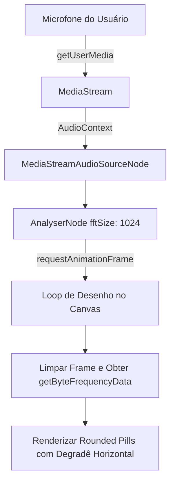

# Documentação Técnica: Desafio de Pronúncia e Estúdio do Karaokê 🎙️🎈

Esta documentação descreve a arquitetura, o funcionamento e as recentes melhorias de experiência de usuário (UX) e visualização em tempo real implementadas no **Desafio de Pronúncia** dentro da aba do Karaokê do Memorize.

---

## 1. Visão Geral

O **Desafio de Pronúncia** é um modo interativo projetado para permitir que os usuários pratiquem a conversação e a cantoria de faixas de áudio importadas ou textos integrados. Ele utiliza a **Web Speech API** para o reconhecimento de fala em inglês (lang: `en-US`), compara a transcrição falada com a letra original em tempo real por meio da métrica de similaridade baseada na distância de Levenshtein por palavra, e fornece feedback imediato (visual e gamificado).

---

## 2. Componentes e Funcionalidades Principais

### A. Painel de Reconhecimento de Voz (Rodapé)
Em vez de renderizar as métricas inline embaixo da letra, o feedback completo de pronúncia foi estruturado em um painel fixo no rodapé do container de letras para evitar poluição visual durante a leitura rápida. Este painel abriga:
1. **Visualizador de Ondas do Microfone**: Renderiza um gráfico de barras suavizado que acompanha as frequências de áudio captadas.
2. **Word Diff (Diferença de Palavras)**: Compara a fala com o texto esperado, marcando cada palavra em badges com estilos glassmorphic:
   - **Verde/Esmeralda**: Palavra pronunciada corretamente.
   - **Vermelho/Rosa**: Palavra pronunciada incorretamente.
   - **Vermelho Suave**: Palavra ausente ou pulada.
3. **Transcrição de Voz**: Exibe o texto literal detectado pelo microfone ("Você falou: ...").
4. **Precisão & Média**:
   - **Precisão**: Mostra a nota de precisão da frase corrente (de 0% a 100%) com uma animação progressiva de contagem rodando em `650ms`.
   - **Média do Álbum**: Média ponderada de todas as linhas já avaliadas na sessão atual.

---

### B. Visualizador de Ondas em Tempo Real (Canvas API)
Implementado no arquivo [KaraokePage.tsx](file:///c:/pessoal/memorize/src/pages/KaraokePage.tsx), o visualizador usa a **Web Audio API** e a **Canvas API** para renderizar o espectro da voz do usuário em estilo *Soundbar* premium.

#### Fluxo de Captura e Desenho:

#### Detalhes Técnicos de Renderização:
- **Tamanho do Buffer**: Configurado com `fftSize = 1024` para um equilíbrio ideal entre desempenho e detalhes gráficos.
- **Suavização das Bordas**: Aplica-se uma função de janela senoidal (`Math.sin((i / (barCount - 1)) * Math.PI)`) sobre o índice das barras para atenuar as pontas do espectro, garantindo um visual centralizado e profissional.
- **Formato Arredondado (Pills)**: Utiliza `ctx.lineCap = 'round'` para desenhar as barras. Quando a altura calculada da frequência é menor do que a espessura da barra (`barWidth = 4.5px`), o Canvas desenha um círculo fixo (`ctx.arc`) para evitar deformações, garantindo que o visualizador mostre pontinhos circulares perfeitos mesmo no silêncio.
- **Gradiente Premium**: As barras são coloridas usando um degradê linear horizontal de quatro cores coordenado: Azul (`#3b82f6`) $\rightarrow$ Indigo (`#6366f1`) $\rightarrow$ Violeta (`#8b5cf6`) $\rightarrow$ Rosa (`#ec4899`).

---

### C. Balões de Feedback Flutuantes (Gamificação)
Para recompensar o esforço do usuário e gamificar a cantoria, balões de texto coloridos surgem e flutuam de forma ascendente pela tela.

#### Avaliação de Acordo com a Pronúncia (Tiers):
| Pontuação | Mensagens Aleatórias | Efeito / Cor Gradiente |
| :--- | :--- | :--- |
| **Score $\ge$ 90%** | *Excelente! 🌟, Perfeito! 🏆, Incrível! 🔥, Espetacular! ⚡* | Esmeralda a Teal (Sombra Verde) |
| **Score $\ge$ 80%** | *Ótimo! ⭐, Arrasou! 🎉, Muito afinado! 🎵, Continue assim! 💪* | Cyan a Azul (Sombra Azul) |
| **Score $\ge$ 65%** | *Muito bom! 👍, Mandou bem! 😎, No ritmo! 🥁, Continue assim! 💪* | Indigo a Roxo (Sombra Violeta) |
| **Score $\ge$ 45%** | *Médio! 🙂, Bom começo! 👍, Quase lá! ✨, Vamos lá! 🎙️* | Amber a Laranja (Sombra Laranja) |
| **Score $<$ 45%** | *Ruim 😢, Tente de novo! 🎙️, Mais uma vez! 🔁, Não desista! ❤️* | Rose a Rosa (Sombra Rosa) |

#### Lógica de Gatilho Duplo (Prevenção de Perdas):
A Web Speech API pode atrasar o encerramento da frase caso o usuário cante linhas muito juntas, o que impedia os balões de aparecerem no fim de frases individuais. Por isso, implementou-se um mecanismo robusto de gatilhos:
1. **Gatilho de Transcrição Final (Real-time)**: Assim que o motor do navegador fecha uma frase finalizada (`finalTranscript === true`), o balão é disparado imediatamente usando a pontuação calculada.
2. **Gatilho de Transição de Linha (Linha Anterior)**: Caso a música avance para a próxima linha (`activeLineIdx` mude) e o balão da linha anterior ainda não tenha sido disparado (rastreado por uma referência persistente `triggeredBalloonsRef`), o sistema automaticamente recupera a maior nota alcançada pelo usuário enquanto cantava aquela linha e dispara o balão de feedback correspondente retroativamente.
3. **Prevenção de Cortes por Unmount**: Os balões são renderizados em um container global de overlay absoluto (`absolute inset-0 z-40 overflow-hidden`) na raiz do painel de letras. Isso garante que a animação de flutuação (`float-balloon`, duração de `2.5s`) complete suavemente do início ao fim, mesmo se a linha que gerou o balão seja desmontada da lista devido à paginação das letras.

---

### D. Ciclo de Vida do Microfone e Gerenciamento de Áudio (Auto-Mic)
O acesso ao microfone do usuário e os canais de processamento do áudio são ativados e destruídos de forma reativa a fim de evitar sobrecarga e respeitar as permissões do navegador:
- **Ativação Automática (Auto-Mic)**: O microfone é ativado automaticamente assim que o usuário entra no modo de Desafio de Pronúncia ou troca de faixa de áudio (`activeTrack?.id` muda) enquanto está com o modo ativo.
- **Limpeza de Recursos (`cleanupMicVisualizer`)**:
  - Cancela o loop de renderização usando `cancelAnimationFrame`.
  - Fecha a captura do `MediaStream` interrompendo cada track individual (`track.stop()`), fazendo com que o ícone de gravação do navegador se apague imediatamente ao mudar de aba ou sair do Karaokê.
  - Encerra o `AudioContext` de captura para liberar o hardware de áudio do dispositivo.

---

### E. Otimização de Tela Cheia e Ocultação do Cabeçalho
Quando o Karaokê entra no modo **Tela Cheia** (`isKaraokeFullscreen` em [App.tsx](file:///c:/pessoal/memorize/src/App.tsx) é verdadeiro):
- A barra lateral de navegação e o cabeçalho principal do aplicativo (que contém o logotipo "Memorize") são totalmente ocultados do DOM (`!isKaraokeFullscreen`).
- Isso maximiza a área vertical útil da página, dando mais visibilidade para a rolagem das frases e o painel de reconhecimento de voz.
- O cabeçalho interno de controle do estúdio de Karaokê (que contém atalhos e seleção de modos) permanece fixo no topo do container para permitir fácil acesso de saída e troca de parâmetros.
