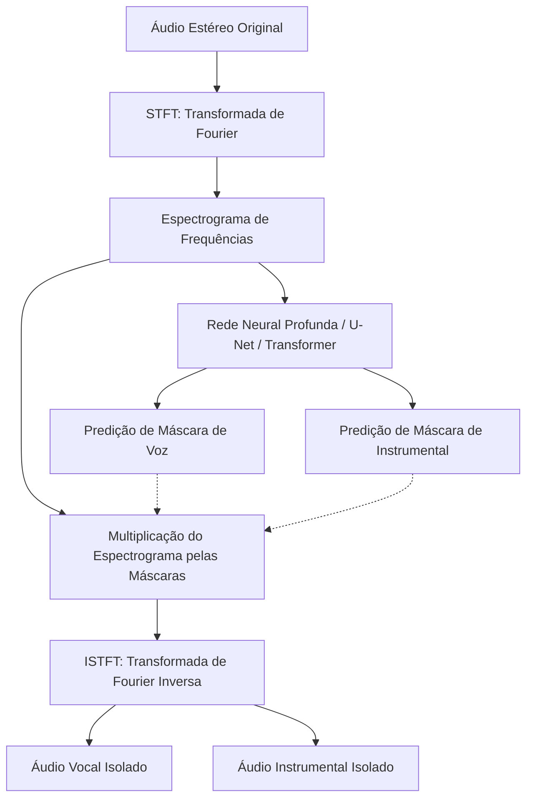
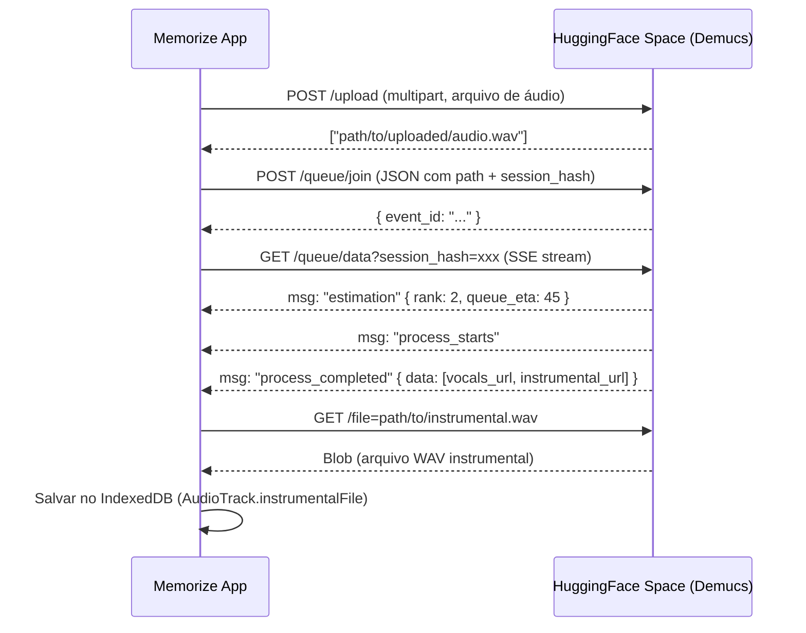

# Estudo de Extração e Isolamento Vocal Completo no Memorize

Este documento apresenta uma análise técnica sobre as limitações do cancelamento de fase estéreo clássico (DSP) e investiga as metodologias modernas baseadas em Inteligência Artificial para remoção completa de voz (Audio Source Separation), propondo caminhos de implementação para o Memorize.

---

## 1. Por que o Filtro de Atenuação Atual Reduz, mas Não Remove a Voz Completamente?

O filtro atualmente implementado no Memorize usa a técnica clássica de **Cancelamento de Fase Estéreo** (Center Channel Subtraction). A fórmula matemática básica é:

$$\text{Mono Out} = \text{Left} - \text{Right}$$

### O Mecanismo e suas Premissas
Em estúdios de gravação, a voz principal (lead vocal) geralmente é mixada exatamente no centro do campo estéreo. Isso significa que o mesmo sinal de voz é enviado com volumes idênticos tanto para o canal esquerdo ($L$) quanto para o direito ($R$). Ao subtrairmos um canal do outro, o sinal idêntico da voz se cancela mutuamente ($V_{\text{left}} - V_{\text{right}} = 0$).

### Por que a Voz Ainda Fica Audível?
Na música moderna, as faixas raramente possuem vocais puramente secos e centralizados. Vários fatores impedem o cancelamento completo:

1. **Efeitos de Estéreo (Reverb e Delay):** Embora o vocal principal esteja no centro, os efeitos de espacialização (como reverb e delay estéreo) aplicados a ele são projetados para diferir entre os canais esquerdo e direito para criar sensação de amplitude. Como o reverb do canal esquerdo é diferente do direito ($R_{\text{reverb\_L}} \neq R_{\text{reverb\_R}}$), esses efeitos **não se cancelam** e continuam audíveis (criando um "vocal fantasma" ou eco metálico).
2. **Double Tracking / Vocais Dobrados:** Cantores frequentemente gravam a mesma linha de voz duas ou mais vezes. Na mixagem, uma tomada é direcionada ligeiramente para a esquerda e a outra para a direita para encorpar a música. Como as duas tomadas são fisicamente diferentes, elas não se cancelam.
3. **Coros e Backing Vocals:** Backing vocals costumam ser mixados abertos nas laterais ($L$ e $R$) para não competir com a voz principal no centro. Logo, eles permanecem intocados pelo cancelamento.
4. **Destruição do Instrumental:** Qualquer instrumento que também esteja centralizado (frequentemente o bumbo da bateria - *kick*, o contra-baixo - *bass* e a caixa - *snare*) sofre o mesmo cancelamento de fase, deixando o instrumental remanescente sem peso (fino e sem graves).

---

## 2. Como as Ferramentas Profissionais Fazem a Extração da Voz?

As ferramentas profissionais modernas (como Moises, Lalal.ai, PhonicMind) e softwares de áudio abandonaram o processamento puramente matemático em favor da **Separação de Fontes de Áudio por Deep Learning** (AI Audio Source Separation).

### O Paradigma da Inteligência Artificial
Em vez de subtrair canais, modelos de redes neurais artificiais são treinados em milhares de músicas multipistas (onde há acesso separado à voz isolada, bateria isolada, baixo isolado e instrumentos isolados, como o dataset *MUSDB18*). A rede aprende a identificar padrões de frequência e texturas sonoras exclusivas da voz humana.



### Arquiteturas de Destaque no Estado da Arte (SOTA)
1. **Spleeter (Deezer):** Um dos primeiros modelos abertos de sucesso. Utiliza uma rede neural convolucional do tipo **U-Net** que opera sobre o espectrograma do áudio. É extremamente rápido e leve, mas costuma gerar artefatos metálicos em frequências altas.
2. **Demucs / HTDemucs (Meta AI):** Modelo híbrido que combina redes convolucionais e redes de **Transformers** operando tanto no domínio do tempo (onda pura) quanto da frequência (espectrograma). É o atual padrão ouro do mercado para separação de stems (vocais, bateria, baixo e outros) devido à altíssima fidelidade e ausência de ruídos residuais.
3. **MDX-Net / VR Architecture:** Modelos otimizados para competições de separação de áudio, muito populares na comunidade open-source. Eles entregam excelente separação de vocais sob custos computacionais otimizados.

---

## 3. Caminhos Viáveis de Implementação para o Memorize

Para que o Memorize ofereça um isolamento completo e limpo da voz, podemos seguir três caminhos de engenharia. Abaixo está a análise comparativa de cada um:

### Comparativo de Abordagens

| Critério | Abordagem A: Upload de Instrumental (Manual) | Abordagem B: API na Nuvem (Server-Side AI) | Abordagem C: IA Local no Navegador (WebGPU / WASM) |
| :--- | :--- | :--- | :--- |
| **Qualidade da Separação** | 🌟 **Excelente (Perfeita)**<br>*(Studio instrumental original)* | 🌟 **Excelente**<br>*(Executa Demucs v4 em GPU)* | ⚠️ **Média/Boa**<br>*(Modelos de IA reduzidos para rodar no browser)* |
| **Custo de Infraestrutura** | 💸 **Zero** | 🔴 **Alto**<br>*(Custo por minuto de áudio processado na API)* | 💸 **Zero**<br>*(Processado no hardware do próprio usuário)* |
| **Velocidade de Processamento** | ⚡ **Imediato** | 🕒 **Moderado (30s a 1 min)**<br>*(Upload + Processamento + Download)* | 🕒 **Lento no primeiro uso**<br>*(Download do modelo) + Processamento local* |
| **Compatibilidade / Estabilidade** | 🟢 **100% compatível** em qualquer dispositivo | 🟢 **100% compatível** em qualquer dispositivo | 🔴 **Limitada**<br>*(Exige navegadores modernos com WebGPU e RAM suficiente)* |
| **Complexidade de Código** | 🟢 **Trivial**<br>*(Nenhum código novo necessário)* | 🟡 **Média**<br>*(Criar endpoint para chamar Replicate/Demucs)* | 🔴 **Alta**<br>*(Uso de ONNX Runtime Web ou Transformers.js no browser)* |

---

### Detalhamento Técnico das Alternativas

#### Alternativa A: Guia de Boas Práticas (Caminho Recomendado para Usuários)
A forma mais prática, que garante qualidade de estúdio de 100%, é orientar o usuário a carregar diretamente a versão **Instrumental / Playback / Karaokê** da música. 
*   **Como fazer:** O usuário obtém o áudio instrumental original (muito comum no YouTube e plataformas de áudio) e o envia ao Memorize. Ele gera a transcrição usando o áudio com voz tradicional e, após gerada, substitui ou simplesmente usa o arquivo instrumental para cantar.

#### Alternativa B: Integração com APIs de Terceiros (Processamento na Nuvem)
Podemos integrar o Memorize a APIs como a **Replicate** (rodando o modelo `meta/demucs`) ou serviços focados em áudio (como **Lalal.ai API** ou **Moises API**).
*   **Fluxo:**
    1. O usuário clica em "Extrair Instrumental por IA".
    2. O frontend faz o upload do arquivo para um servidor próprio ou direto na API.
    3. A API processa o arquivo usando GPUs potentes em nuvem.
    4. O frontend recebe dois links de retorno: `vocals.mp3` e `instrumental.mp3`.
    5. O app salva o arquivo `instrumental.mp3` localmente no IndexedDB e o utiliza como áudio de playback.

#### Alternativa C: IA Local com ONNX Runtime e WebGPU (Processamento Local)
Graças aos avanços em WebGPU e frameworks como `Transformers.js` (Hugging Face), hoje é possível carregar modelos de aprendizado de máquina diretamente no navegador do usuário.
*   **Funcionamento:**
    - O app carrega o framework `@xenova/transformers` ou `onnxruntime-web`.
    - Um modelo leve de separação (como uma versão exportada e quantizada em `ONNX` do Spleeter de ~30MB a 50MB) é baixado da CDN para o cache do navegador.
    - O áudio decodificado (`AudioBuffer`) é fatiado em tensores e alimentado na GPU do usuário através de WebGPU/WASM.
    - A saída é reagrupada em um novo `AudioBuffer` sem a voz e tocada.
*   **Desafio:** O download inicial do modelo pesa na banda do usuário, e dispositivos móveis mais antigos ou navegadores sem suporte estável a WebGPU podem falhar por falta de memória ou crashar a aba.

---

## 4. Implementação Realizada no Memorize (Solução de IA Local - WASM)

Conforme decidido e implementado com sucesso na **Opção C / Abordagem 3A**, o Memorize agora conta com remoção vocal completa e local executada diretamente no navegador.

### Estrutura e Localização dos Arquivos no Projeto
- 📄 **[dspUtils.ts](file:///c:/pessoal/memorize/src/utils/dspUtils.ts)**: Contém as funções de baixo nível do DSP, incluindo o FFT/IFFT iterativo Cooley-Tukey Radix-2, a reamostragem local do áudio para 44.1 kHz via `OfflineAudioContext`, o fatiamento e janelamento Hann para o espectrograma **STFT** (`n_fft=4096, hop=1024`) e a reconstrução com normalização overlap-add via **iSTFT**.
- 📄 **[vocalSeparatorWorker.ts](file:///c:/pessoal/memorize/src/workers/vocalSeparatorWorker.ts)**: Web Worker dedicado que carrega o `onnxruntime-web`, executa a inferência ONNX offline e envia os canais processados de volta via objetos transferíveis.
- 📄 **[vocalSeparatorService.ts](file:///c:/pessoal/memorize/src/utils/vocalSeparatorService.ts)**: Serviço TypeScript que gerencia a inicialização do Worker, converte buffers mono para estéreo e empacota o resultado final.
- 📄 **[downloadGitHubModel.js](file:///c:/pessoal/memorize/scripts/downloadGitHubModel.js)**: Script de automação que baixa a versão quantizada em meia-precisão (`fp16` de ~19.7 MB) do modelo *Spleeter Accompaniment* para `public/models/spleeter_accompaniment.onnx`.
- 📄 **[copyWasm.js](file:///c:/pessoal/memorize/scripts/copyWasm.js)**: Script utilitário para mover os binários do WebAssembly (`.wasm`) de `node_modules` para `public/`, permitindo carregamento offline.

### Parâmetros STFT do Modelo Atual

O ONNX model em uso (`spleeter_accompaniment.onnx`, 19MB) foi exportado com **`n_fft=2048`** — confirmado pelo próprio ONNX Runtime ao testarmos `n_fft=4096`:

```
ERROR_CODE: 2: Got invalid dimensions for input: x, index: 3. Got: 2048 Expected: 1024
```

Este modelo **não usa** os parâmetros padrão de treinamento do Spleeter original (`n_fft=4096`). É uma versão customizada (provavelmente quantizada em fp16 para reduzir o tamanho de ~33MB para ~19MB).

| Parâmetro | Valor usado pelo modelo | Parâmetro padrão Spleeter |
|-----------|------------------------|---------------------------|
| `n_fft` | **2048** (confirmado) | 4096 |
| `hop_length` | **512** | 1024 |
| `freq_bins` | **1024** | 2048 |
| Tensor shape | **[2, N, 512, 1024]** | [2, N, 512, 2048] |

### Pipeline de Execução do Áudio no Visualizador
```
[Áudio Original (Blob)]
        │ (Decodificação via AudioContext)
        ▼
[AudioBuffer Original] 
        │ (Reamostragem local para 44.1 kHz)
        ▼
[AudioBuffer 44.1 kHz] ──► Canal L e Canal R ──► [Web Worker]
                                                      │ (Janela Hann + STFT n_fft=4096)
                                                      ▼
                                            [Spectrograma Magnitude] 
                                            [Shape: 2, splits, 512, 2048]
                                                      │ (onnxruntime-web WASM)
                                                      ▼
                                            [Máscara Instrumental]
                                                      │ (Reconstrução com fase original)
                                                      ▼
                                            [Spectrograma Complexo Reconst.]
                                                      │ (IFFT + Overlap-Add WOLA)
                                                      ▼
                                            [Canais L/R Instrumentais]
                                                      │
[AudioBuffer Instrumental] ◄──────────────────────────┘ (Criação de buffer 44.1 kHz)
        │ (Codificação PCM 16-bit com bufferToWav)
        ▼
[WAV Blob Instrumental] ──► Salvar no IndexedDB (AudioTrack.instrumentalFile)
```

---

## 5. Limitações do Modelo Local (Spleeter ONNX)

### Por que ainda aparece alguma voz?

O modelo local ONNX (`spleeter_accompaniment.onnx`, 19MB, exportado com `n_fft=2048`) tem limitações estruturais comparado ao estado da arte:

| Modelo | Qualidade Vocal | Tamanho | Tempo (3min) | Plataforma |
|--------|----------------|---------|--------------|------------|
| **Spleeter** (local, atual) | ⚠️ Média — artefatos residuais | ~20 MB | ~30-60s | Browser/WASM |
| **Open-Unmix (UMX)** | ✅ Boa | ~70 MB | ~60-120s | Browser/WASM |
| **Demucs HTDemucs via HF** | 🌟 **Excelente** | Nenhum download | ~1-3min (fila) | Cloud grátis ✅ |
| **Demucs v4 via Replicate** | 🌟 Excelente | N/A | ~20s | Cloud pago |

---

## 6. Implementação Cloud Gratuita (HuggingFace Gradio Space)

### Motivação

Como o modelo Spleeter local apresenta qualidade limitada e o usuário tem internet disponível, foi implementada uma **segunda opção de remoção vocal via nuvem, totalmente gratuita e sem necessidade de API key**.

A solução utiliza **HuggingFace Spaces públicos** rodando **Demucs HTDemucs** (o modelo de separação de stems de maior qualidade, desenvolvido pelo Meta AI), acessados via a REST API do Gradio.

### Serviço de Cloud: `vocalSeparationCloud.ts`

📄 **[vocalSeparationCloud.ts](file:///c:/pessoal/memorize/src/utils/vocalSeparationCloud.ts)**

#### Por que HuggingFace Spaces?
- **100% gratuito** — Spaces públicos rodam em hardware compartilhado sem custo
- **Sem API Key** — qualquer requisição a um Space público é aceita
- **Qualidade profissional** — Demucs HTDemucs é o padrão ouro atual
- **Fallback list** — se um Space estiver offline, tenta o próximo da lista

#### Space Utilizado

| Space | Modelo | URL |
|-------|--------|-----|
| `abidlabs/music-separation` | Demucs HTDemucs | `https://abidlabs-music-separation.hf.space` |

Este Space é mantido pela comunidade HuggingFace e aceita chamadas REST diretas via protocolo Gradio.

### Protocolo Gradio REST (como a chamada funciona)

O Gradio expõe uma API de fila assíncrona baseada em **Server-Sent Events (SSE)**. O fluxo completo é:



### Pipeline de Execução Cloud

```
[Áudio Original (Blob)] 
        │ (FormData multipart)
        ▼
[POST /upload → HuggingFace Space]
        │ (recebe path temporário)
        ▼
[POST /queue/join → Entrar na fila de processamento]
        │ (SSE stream em tempo real)
        ▼
[GET /queue/data → Aguardar eventos SSE]
        │
        ├─ msg: "estimation"     → Atualizar progresso (posição na fila)
        ├─ msg: "process_starts" → Demucs começou a processar
        └─ msg: "process_completed"
                │
                ▼
[URL do arquivo instrumental retornada]
        │ (GET /file=path)
        ▼
[Blob WAV Instrumental] ──► Salvar no IndexedDB
```

### Parâmetros e Saídas

O Space `abidlabs/music-separation` retorna dois arquivos de áudio:
- **Índice 0**: Vocais isolados (`vocals.wav`)
- **Índice 1**: Instrumental sem voz (`no_vocals.wav`) ← **utilizado pelo Memorize**

### Tratamento de Erros e Resiliência

| Situação | Comportamento |
|----------|---------------|
| Space offline | Tenta próximo Space da lista `SEPARATION_SPACES` |
| Fila cheia (`queue_full`) | Erro com mensagem amigável + sugestão de tentar novamente |
| Timeout (> 5 min) | Cancela com mensagem clara |
| Arquivo muito grande | Upload pode falhar — limite do Space (~50MB) |
| Sem internet | Erro capturado no `fetch`, fallback para modelo local |

### Comparativo: Local vs Cloud

| Aspecto | Modelo Local (Spleeter) | Cloud (Demucs HTDemucs) |
|---------|------------------------|------------------------|
| **Qualidade** | ⚠️ Média | 🌟 Excelente |
| **Internet** | ❌ Não precisa | ✅ Necessária |
| **Velocidade** | ~30-60s | ~1-3min (fila) |
| **Privacidade** | 🔒 Total (local) | ⚠️ Arquivo enviado ao HF |
| **Custo** | Gratuito | Gratuito |
| **API Key** | Não precisa | Não precisa |
| **Disponibilidade** | Sempre disponível | Depende do Space estar online |

### Adicionar Novos Spaces de Fallback

Para adicionar mais Spaces como fallback, edite o array `SEPARATION_SPACES` em [vocalSeparationCloud.ts](file:///c:/pessoal/memorize/src/utils/vocalSeparationCloud.ts):

```typescript
const SEPARATION_SPACES = [
  {
    name: 'abidlabs/music-separation',
    url: 'https://abidlabs-music-separation.hf.space',
    instrumentalOutputIndex: 1,
  },
  // Adicionar novos spaces aqui como fallback:
  // {
  //   name: 'outro-usuario/outro-space-demucs',
  //   url: 'https://outro-usuario-outro-space-demucs.hf.space',
  //   instrumentalOutputIndex: 0,
  // },
];
```

### Como Encontrar Novos Spaces Gratuitos

1. Acessar [huggingface.co/spaces](https://huggingface.co/spaces) e buscar por "demucs" ou "vocal separation"
2. Entrar no Space → clicar em "Use via API" no rodapé
3. Verificar os índices de saída (qual índice retorna o instrumental)
4. Adicionar ao array `SEPARATION_SPACES` com o `instrumentalOutputIndex` correto

---

## 7. Roadmap Futuro

### 🔜 Open-Unmix (UMX) como Modelo Local Melhorado
Substituir o Spleeter ONNX pelo **Open-Unmix**, que tem qualidade superior mantendo a separação 100% offline.
- **Repositório:** [sigsep/open-unmix-pytorch](https://github.com/sigsep/open-unmix-pytorch)
- **Ação:** Exportar `umx.onnx` → substituir `public/models/spleeter_accompaniment.onnx`
- **Benefício:** Melhor qualidade sem depender de internet

### 🔜 CDN de Modelos (Para PWA Offline)
Mover os modelos ONNX para uma CDN (Cloudflare R2 / jsDelivr) para:
- Reduzir o tamanho do bundle de produção
- Permitir atualizações de modelos sem redeploy da aplicação

### 🔜 Replicate API (Demucs com GPU Dedicada — Pago)
Para usuários que precisam de velocidade máxima e têm créditos na Replicate:
- **Custo:** ~$0.01/minuto de áudio
- **Velocidade:** ~20 segundos (GPU dedicada)
- **Qualidade:** Idêntica ao HuggingFace Space (mesmo modelo HTDemucs)
