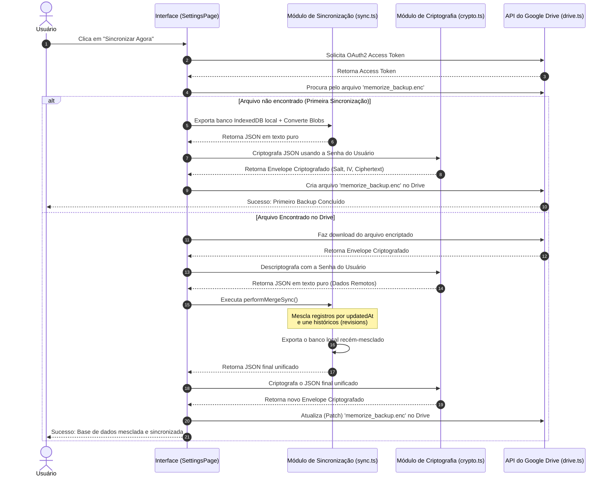

# Especificação de Design: Sincronização Criptografada com Google Drive

Este documento detalha os requisitos, arquitetura técnica e detalhes de implementação do sistema de sincronização e criptografia ponta a ponta (cliente-side) para o aplicativo Memorize.

---

## 1. Visão Geral

O Memorize é um aplicativo local-first estruturado em cima do IndexedDB (via Dexie.js). Para permitir o uso do aplicativo em múltiplos dispositivos (computador, celular, tablet) mantendo a privacidade total dos dados do usuário, modelamos um sistema de sincronização que:

1. **Usa o Google Drive** do próprio usuário como repositório de arquivos.
2. **Criptografa todos os dados localmente** antes que eles saiam do dispositivo, garantindo que o Google ou terceiros nunca leiam o conteúdo dos cartões e estudos (Zero-Knowledge).
3. **Realiza mesclagem bidirecional (Two-way smart merge)** para resolver conflitos de edição de forma inteligente ao invés de sobrescrever cegamente o banco de dados.

---

## 2. Requisitos do Sistema

### 2.1 Requisitos de Segurança e Privacidade
* **Criptografia nativa:** Uso da Web Crypto API, disponível nativamente nos navegadores modernos.
* **Derivação de Chaves:** A chave criptográfica deve ser gerada a partir de uma senha definida pelo usuário usando o algoritmo **PBKDF2** com sal (salt) aleatório de 16 bytes e 100.000 iterações de hashing SHA-256.
* **Algoritmo de Cifra:** **AES-GCM (256-bit)** para criptografia simétrica rápida e segura dos dados serializados.
* **Escopo Mínimo de Permissões:** Solicitar apenas o escopo `https://www.googleapis.com/auth/drive.file` do Google Drive, que limita o acesso da aplicação estritamente aos arquivos criados ou abertos por ela própria.

### 2.2 Requisitos de Sincronização (Merge Sync)
* **Entidades Sincronizadas:** Devem ser exportadas e sincronizadas as 9 tabelas do Dexie:
  * `decks` (Baralhos)
  * `cards` (Cartões)
  * `notes` (Notas/Fatos de origem)
  * `revisions` (Histórico de revisões do SRS)
  * `presets` (Configurações de estudo)
  * `readings` (Textos de leitura rápida)
  * `readingSessions` (Telemetria de leitura)
  * `readingCollections` (Coleções/Pastas de textos)
  * `chatMessages` (Mensagens de chat de voz por IA)
* **Resolução de Conflitos por Carimbo de Data/Hora:**
  * Cada registro alterado possui um campo `updatedAt`.
  * Na mesclagem, compara-se o registro local com o remoto pelo `id`. O registro com o maior `updatedAt` é preservado.
* **União de Tabelas de Histórico (Log):**
  * Históricos de revisões (`revisions`), sessões de leitura (`readingSessions`) e mensagens (`chatMessages`) são estruturados como logs históricos ordenados. O algoritmo de sincronização deve realizar a união desses registros pelo `id` para consolidar o histórico de ambos os dispositivos sem perda de dados.
* **Suporte a Mídias Binárias:**
  * O áudio dos cartões (`Card.audio`) e notas (`Note.audio`) e os anexos PDF de leitura (`ReadingText.pdfFile`) são armazenados localmente como `Blob`.
  * Eles devem ser convertidos em strings Data URL Base64 para serialização JSON na exportação e reconvertidos para `Blob` no IndexedDB na importação.

### 2.3 Requisitos de Interface e Experiência do Usuário (UI/UX)
* **Painel Premium nas Configurações:** Integração de uma seção dedicada em `SettingsPage.tsx` com visual moderno, suporte ao tema do sistema (Zinc, Blue, Green, Violet, Orange, Rose) e animações suaves.
* **Senha sob Demanda (Sem Persistência):** A senha de criptografia nunca é salva no navegador ou no armazenamento local (`localStorage`). Em toda sincronização (manual ou ao carregar o aplicativo), o usuário é solicitado interativamente via modal a digitar a senha. Ela é mantida em memória volátil apenas durante o processo e descartada imediatamente após o término ou erro da sincronização.
* **OAuth2 Client ID Configurável:** Opção avançada nas configurações para o desenvolvedor ou usuário avançado alterar o Google Client ID.
* **Feedback Visual de Progresso**: Exibição de uma barra de progresso e mensagens de status detalhando o passo-a-passo da operação em andamento.
* **Sincronização Automática:** Opção para disparar o fluxo de sincronização automaticamente ao carregar o aplicativo (o que abrirá o modal de senha caso necessário).

---

## 3. Arquitetura Técnica

### 3.1 Diagrama de Fluxo de Sincronização



### 3.2 O Envelope Criptografado (JSON Schema)

Os dados criptografados salvos no arquivo `memorize_backup.enc` no Google Drive seguem esta estrutura de metadados:

```json
{
  "salt": "string (base64 do sal PBKDF2)",
  "iv": "string (base64 do vetor de inicialização AES-GCM)",
  "ciphertext": "string (base64 do texto encriptado)",
  "version": "memorize-encrypted-v1",
  "updatedAt": 1748567890000
}
```

---

## 4. Estratégia de Testes

Para garantir a confiabilidade do sistema e evitar a corrupção de dados dos usuários, as funcionalidades críticas são cobertas por testes automatizados em duas frentes:

### 4.1 Testes de Criptografia (`src/utils/crypto.test.ts`)
* **Sucesso na Criptografia/Decriptografia:** Garante que strings criptografadas com uma senha são restauradas perfeitamente.
* **Tratamento de Senha Incorreta:** Valida se a tentativa de descriptografia com senha inválida lança uma exceção limpa com a mensagem de erro esperada.
* **Aleatoriedade de Chaves:** Garante que chamadas repetidas para a mesma entrada resultam em cifra e sal/iv diferentes (prevenindo ataques de dicionário).
* **Grandes Volumes de Dados:** Verifica a integridade da decifração com estruturas JSON complexas contendo centenas de registros de cartões e baralhos simulados.

### 4.2 Testes de Mesclagem de Banco de Dados (`src/utils/sync.test.ts`)
* **Inexistência Local:** Verifica se novos baralhos remotos são adicionados ao banco local.
* **Remoto Mais Recente:** Garante que baralhos locais antigos sejam atualizados com os dados mais recentes do Drive.
* **Local Mais Recente:** Garante que alterações locais recentes não sejam substituídas por dados remotos antigos.
* **União de Logs Históricos:** Valida se o histórico de revisões SRS (`revisions`) mescla de forma aditiva os registros sem duplicar dados.
