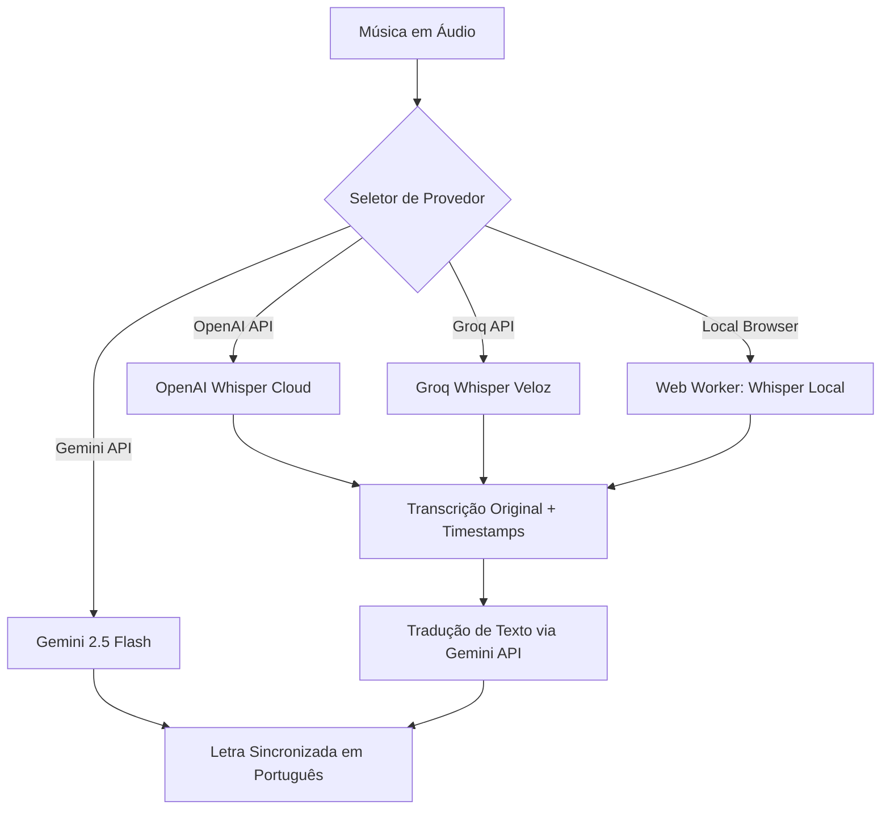

# Sistema de Transcrição e Sincronização Multiprovedor (Karaokê)

Este documento detalha o funcionamento, arquitetura e configuração do sistema multiprovedor de transcrição e tradução implementado no módulo **Karaokê** do aplicativo Memorize.

---

## 1. Visão Geral do Sistema

O módulo de Karaokê do Memorize permite carregar áudios de músicas e sincronizá-los com letras de forma dinâmica. Para facilitar esse processo, o aplicativo possui uma ferramenta de transcrição automática baseada em inteligência artificial. 

Para dar flexibilidade ao usuário e permitir tanto uso gratuito/privado local quanto alta precisão em nuvem, implementamos quatro provedores distintos de transcrição:

---

## 2. Comparativo de Provedores

| Característica | Gemini 2.5 Flash (Google) | OpenAI Whisper (API) | Groq Whisper (API) | Whisper Local (Navegador) |
| :--- | :--- | :--- | :--- | :--- |
| **Custo** | Pago (Plano gratuito disponível via Google AI Studio) | Pago (~ \$0.006 por minuto de áudio) | Grátis (Limites de teste) ou Pago | **100% Grátis** (Sem custos de infraestrutura) |
| **Precisão** | Muito Boa (foca no sentido geral) | **Excelente** (precisão a nível de palavras e marcação de tempo) | **Excelente** (precisão a nível de palavras e marcação de tempo) | Boa (utiliza o modelo compacto `whisper-tiny`) |
| **Velocidade** | Média (~ 10-15s por música) | Rápida (~ 5-10s por música) | **Extremamente Rápida** (~ 1-2s por música) | Média/Lenta (depende do hardware e processamento local) |
| **Privacidade** | Áudio enviado aos servidores Google | Áudio enviado aos servidores OpenAI | Áudio enviado aos servidores Groq | **Total** (100% offline após primeiro download do modelo) |
| **Requisitos** | Chave da API do Gemini | Chave da API da OpenAI | Chave da API da Groq | Download do modelo (~75MB) no primeiro uso |

---

## 3. O Fluxo de Tradução Híbrida

Modelos do Whisper (OpenAI, Groq e Local) transcrevem o áudio no idioma original falado na música (ex: inglês, espanhol, japonês). No entanto, o Memorize precisa exibir a letra sincronizada no idioma original **e** a tradução correspondente em português linha por linha.

Para resolver isso de forma otimizada e econômica, implementamos o **Fluxo Híbrido**:
1. **Transcrição**: O áudio é enviado ao provedor Whisper escolhido (OpenAI, Groq ou Local). O Whisper retorna o texto original dividido em trechos de tempo com carimbos de início e fim (`startTime` e `endTime`).
2. **Tradução Otimizada**: Pegamos a lista completa de linhas transcritas (texto puro) e fazemos uma **única chamada de texto rápida** para a API do Gemini 2.5 Flash, solicitando a tradução em massa das linhas para o português.
3. **Preservação de Tempos**: Como a tradução é puramente textual e segue a mesma ordem das linhas, mantemos os timestamps (`startTime` e `endTime`) calculados com precisão pelo Whisper e acoplamos a tradução correspondente.
4. **Resultado**: O usuário recebe uma letra sincronizada em tempo real com excelente precisão no idioma nativo e traduções fiéis em português.

---

## 4. Arquitetura do Whisper Local (Web Worker)

Para permitir a transcrição gratuita e offline, foi criada uma integração com o runtime ONNX e a biblioteca `@huggingface/transformers`. O processamento de rede neural é pesado e causaria congelamentos na interface do usuário (UI) se rodasse na thread principal. Por isso, a execução é delegada a um **Web Worker** dedicado.

### Detalhes de Implementação (`src/workers/whisper.worker.ts`):
* **Carregamento e Cache**: O worker baixa o modelo pré-treinado `onnx-community/whisper-tiny` (composto de pesos otimizados de ~75MB). Ele é automaticamente guardado no **Cache Storage** do navegador. Execuções posteriores não consomem tráfego de internet.
* **Aceleração por Hardware**: O pipeline está configurado para tentar usar aceleração via **WebGPU** caso o navegador dê suporte. Se não houver suporte, ele reverte automaticamente para CPU multithreaded via **WebAssembly (WASM)**.
* **Reamostragem Dinâmica (Resampling)**: O modelo Whisper exige áudio estritamente amostrado a **16.000 Hz** (16kHz). O worker possui uma função interna de interpolação linear (`resampleTo16k`) que converte o buffer bruto de áudio `Float32Array` recebido da API de Áudio do navegador (que geralmente opera em 44.1kHz ou 48kHz) para os 16kHz requeridos antes da inferência.

---

## 5. Integração na Interface Gráfica

### Configurações de API Keys (`SettingsPage.tsx`)
Na tela de configurações do aplicativo, foi adicionada uma seção de chaves para os novos provedores com suporte a:
* Armazenamento persistente seguro e privado direto no `localStorage` do navegador do usuário.
* Visualização oculta (campo de senha) com botão para revelar/ocultar.
* Validação de estado indicando visualmente se a chave já está configurada (`Configurada ✅`) ou se precisa ser inserida.
* As chaves cadastradas são:
  - `memorize_openai_api_key`
  - `memorize_groq_api_key`

### Seletor de Modelo (`KaraokePage.tsx`)
No card de controle de transcrição, o botão único de transcrição foi substituído por um conjunto com:
1. **Dropdown de Seleção**: Um menu suspenso permitindo escolher em tempo real qual provedor usar antes de disparar o processamento.
2. **Status Visual Otimizado**: Indicadores de progresso detalhados, especialmente para o Whisper Local, mostrando o progresso percentual de download de cada arquivo do modelo ONNX na primeira execução.

### Modal de Confirmação de Reinício
Para evitar a perda acidental de progresso, ao clicar no botão "Recomeçar do zero" no painel de transcrição do Karaokê, o sistema exibe um modal de confirmação explicando claramente que todos os pedaços já transcritos e salvos temporariamente na base de dados IndexedDB serão perdidos antes de iniciar uma nova transcrição.

---

## 6. Arquivos Relevantes no Projeto

* **Documentação**: [docs/whisper_transcription_options.md](file:///c:/pessoal/memorize/docs/whisper_transcription_options.md)
* **Web Worker**: [src/workers/whisper.worker.ts](file:///c:/pessoal/memorize/src/workers/whisper.worker.ts)
* **Tela de Configurações**: [src/pages/SettingsPage.tsx](file:///c:/pessoal/memorize/src/pages/SettingsPage.tsx)
* **Tela de Karaokê**: [src/pages/KaraokePage.tsx](file:///c:/pessoal/memorize/src/pages/KaraokePage.tsx)
